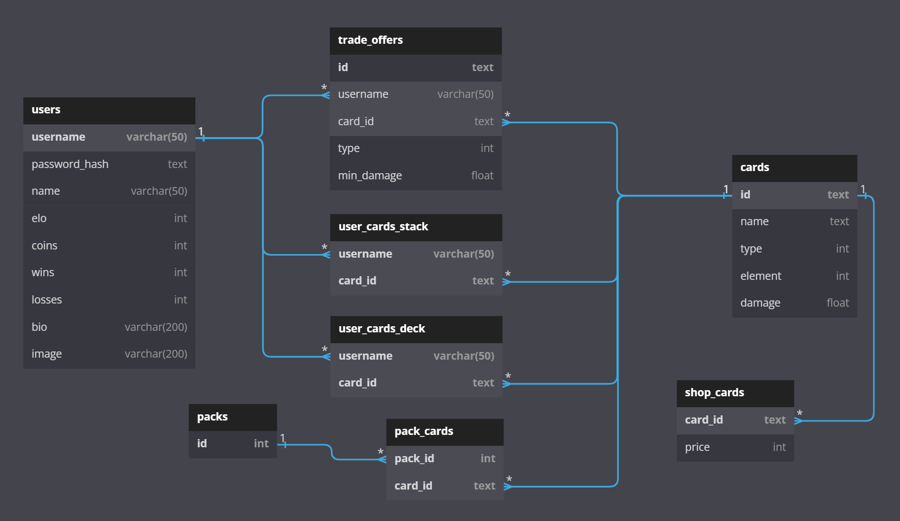

# Monster Trading Card Game Server

## Technical Setup
### Overview
The project represents a server providing a REST-API for a Monster Card Trading Game. The server is multi threaded and can handle multiple requests at once. Data is persisted in a postgresql database. 

### Structure
1. The **database** stores the data
2. The database data is accessed via **DAOs**
3. The raw data from the DAOs is processed and combined in the **repositories**
4. The **controllers** use the repositories to create and modify the data according to the user requests. They are also responsible for most of the request logic and generating the responses to be sent back to the user.
5. In the **App** class, a switch case is responsible for reading the request method and pathname and sending the request to the right controller. The server app also uses the authentication service to authenticate the user via a token. If there is no token present or the token is invalid, the app class directly responds with a 401 Unauthorized Response (except if the user is trying to register/login - this can be done without a token). The app class also ensures that certain routes can only be accessed by the admin user (e.g. the route for creating new packs).

### 1. Database
The database is made up of 8 tables:

### 2. DAOs

The data is then accessed via DAOs for the various models used for the project. All DAOs implement the DAO interface and have `create()`, `read()`, `readById()`, `update()` and delete `create()` methods.

### 3. Repositories
The repositories interact with the DAOs to create and update data. They also translate some of the database models into DTOs that are easier to use in the controllers. For example, the `UserProfileRepository` uses the `userDao`, `stackDao`, `deckDao` and `cardDao` to handle `UserProfile` objects that also includes two ArrayLists for the user deck and stack. The controller can then simply update these ArrayLists and use the `update()` function of the `UserProfileRepository` to automatically update all relevant tables in the database and save the current state of the user.

### 4. Controlers
The controlers are responsible for handling the individual requests and generating the corresponding responses. They get and update the DTOs they get from the Repositories. To avoid the code getting to chaotic in the controllers, the individual responses are pre-defined in the Responses class.

The `BattleController` is also responsible for creating the `Battle` Object and passing it to another thread. The `Battle` Object is where the actual battle logic takes place. At the end of the battle, the `Battle` Object also updates the users (elo, wins, losses) and their cards using the `UserProfileRepository`. After the battle, the `BattleController` can then retrieve the BattleLog from the `Battle` Object and return it to both users.

## REST API

See the `REST API Specification (openapi)` file (from moodle) for an overview of the available routes on the server.

## Unique Feature - Card Shop

The unique feature is a card shop, where users can sell their cards for coins. Other users can then buy those cards for the same amount of coins. The price of a card is automatically calculated based on some of the cards attributes (mostly the cards damage). Before selling to the shop, users can get a price quote to see how much money they would receive for their card when selling to the shop.

The admin also has the ability to create new cards for the shop. In this case, the price for the card can be manually set by the admin.

In addition to the predefinded REST API routes, the following routes were added for the shop:

    GET   /shop                                 -> Get all shop offers
    POST  /shop/quote  (cardId in request body) -> Get price quote for card
    POST  /shop/buy    (cardId in request body) -> Buy card
    POST  /shop/sell   (cardId in request body) -> Sell card
    POST  /shop/create (cardId in request body) -> Create new card for shop (admin only)

## Unit Tests
There are 45 unit tests:
- 26 Repository Tests
- 12 Battle logic tests
- 7 DAO Tests

### Why the unit tests were choosen:
Since the controllers are mostly responsible for receiving and processing requests and forming the correct responses, they are kind of already being tested by the curl script. This is why most of the tests test the repositories and DAOs, since this is where some of the less visible logic takes place and certain bugs could easily go unnoticed in the curl-script (e.g. the user not receiving only their deck cards but also their stack cards when sending a request to /decks, cards not being correctly assigned to the right user, user's elo/wins/losses/coins not being updated correctly, etc.); The `Battle` class was also tested to ensure that the battle logic was working as intended.

### The unit tests explained

#### Dao Tests
For the DAO test, a special test database is created in the `@BeforeAll` function using the `database.sql` script. The database is deleted and re-created every time tests are run, so changes in the `database.sql` file will be reflected in the test database. After every individual test, the `@AfterAll` function uses the `database_clear.sql` script to delete all data from the database so that it is empty for the next test. The individual tests then test the various functions of all the DAOs, such as creating, updating, getting and deleting different objects.

It is important to note that for the DAO testing to work as intended, it is important to have simultanious tests (through multithreading) disabled in JUnit. This is currently still experimental and off by default, but could become a problem for database testing in the future, since the DAO tests all access the test database and have to run sequentially to work.

#### Repository Tests
To test the repositories the needed DAOs for the repository were mocked with Mockito. Then the various repository methods are tested. When creating/updating data using DAOs, captors were used to get and assert the objects passed to the mocked DAOs. When the repository has to read data from the DAOs, Mockito's `when()` method was used to return test data to the repository.

#### Battle Logic Tests
Here the logic for the battles was tested. This includes things like damage calculation and testing for specialities between certain monster types. The Battle logic tests also test whether the `UserProfile` Objects are correctly updated and passed to the mocked `UserProfileRepository` after the battle.